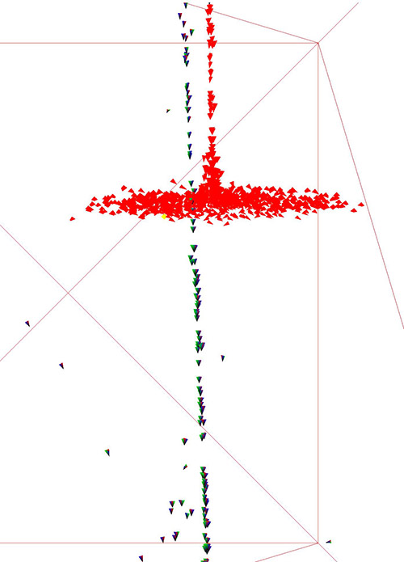
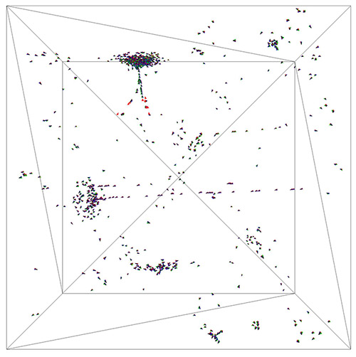
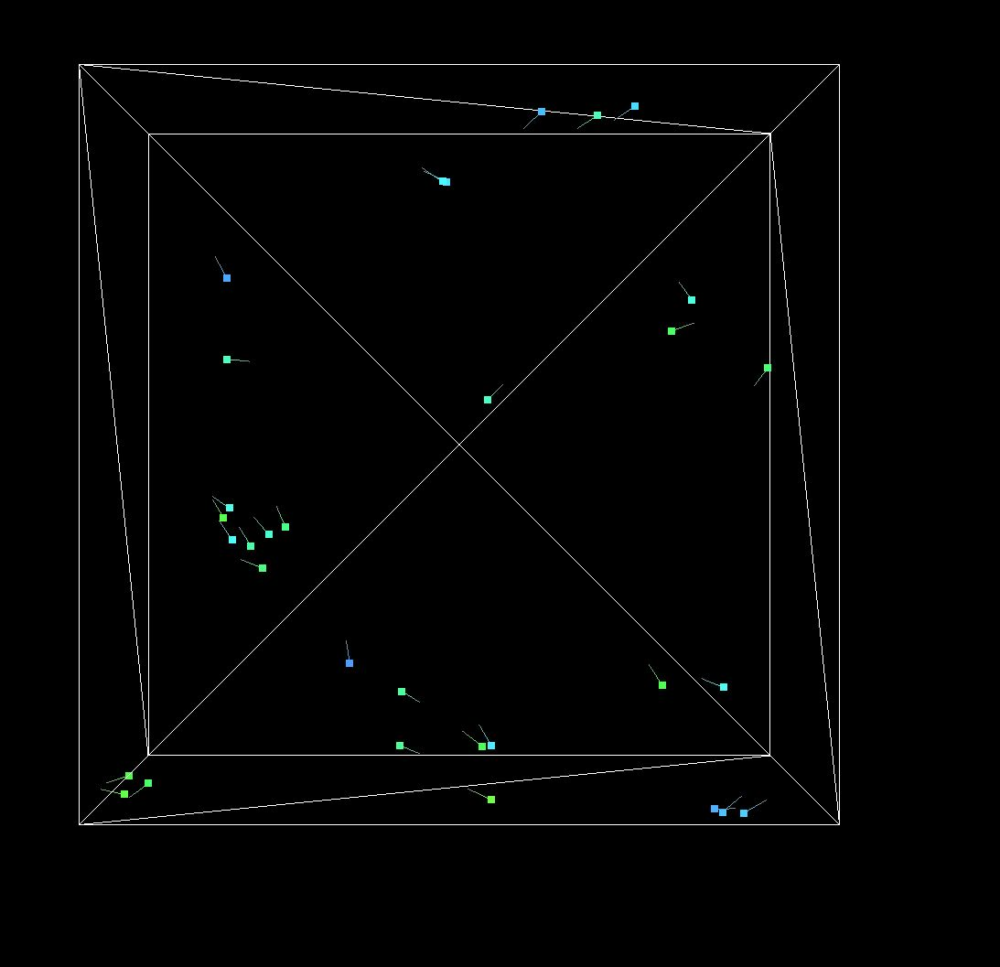

## Homework 3

- The main assignment is in the flocking_nav.cpp file
- flocking_allolib_3D.cpp is a 3D adaptation of the existing flocking example in allolib but does not implement cohesion

### Flocking nav

- Time scale can make the boids move faster or freeze them in their current position

- The index parameter can be used to adjust the boid that will be highlighted (in yellow) and it's flock (red) and boids that are too close (green) 

- The strenght parameters control how much each rule (cohesion, separation and alignment) change the behavior of the boid

- The cohesion radius can incerase the 'view' of the boids so their flock grows

- Some cool swirls

### Flocking Allolib

- This is just an adaptation to 3D of the allolib example

